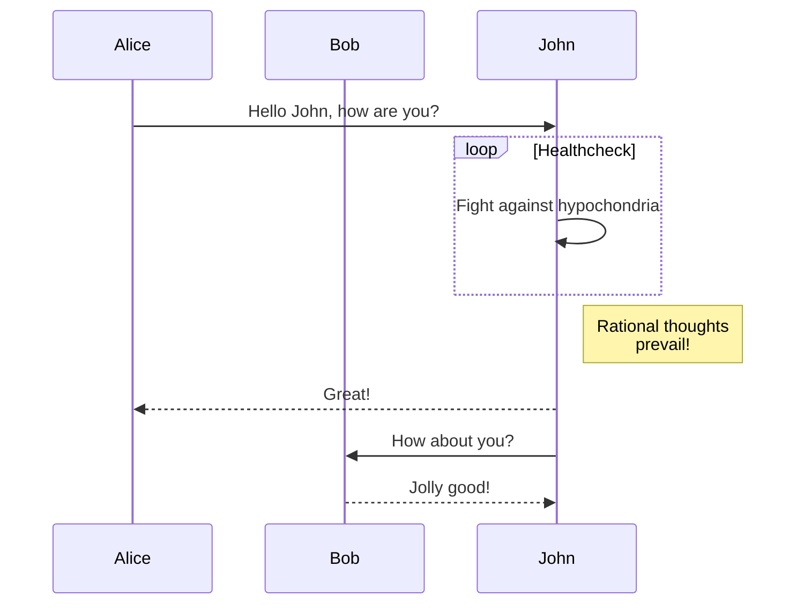
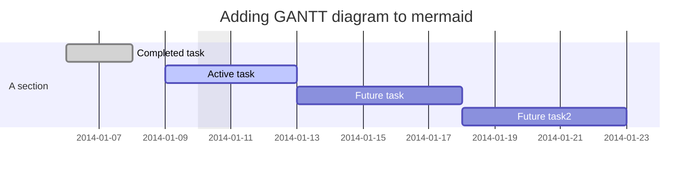
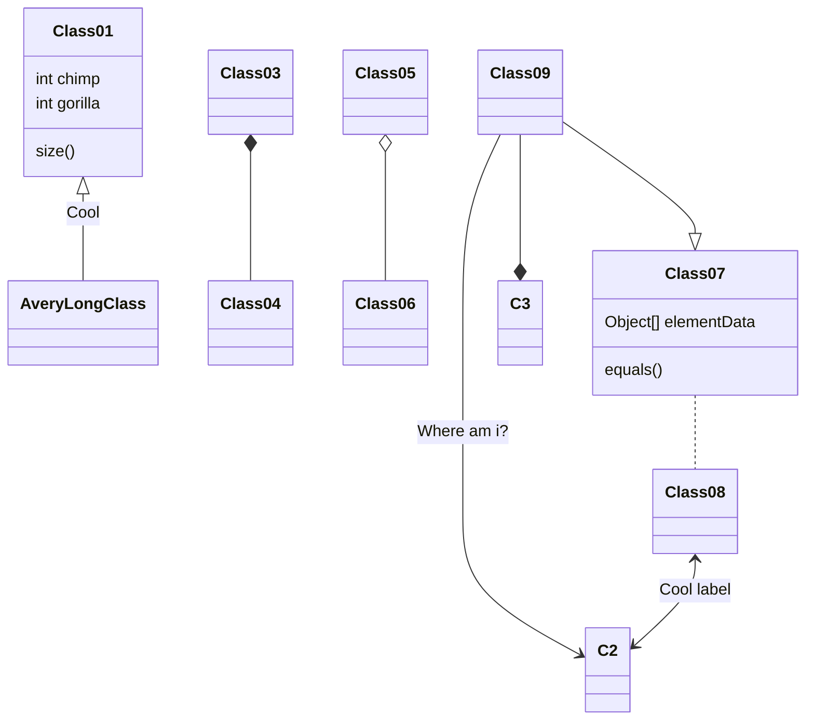
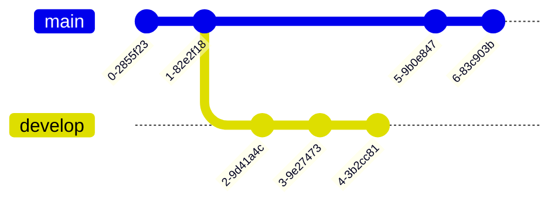
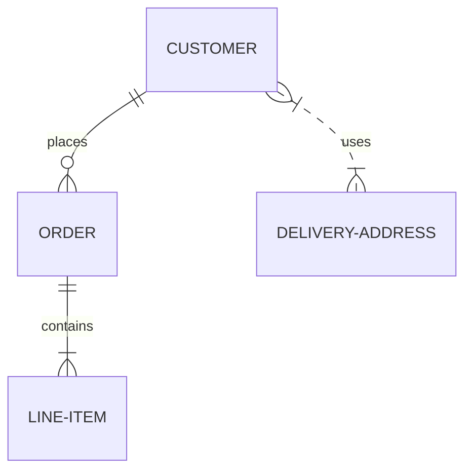
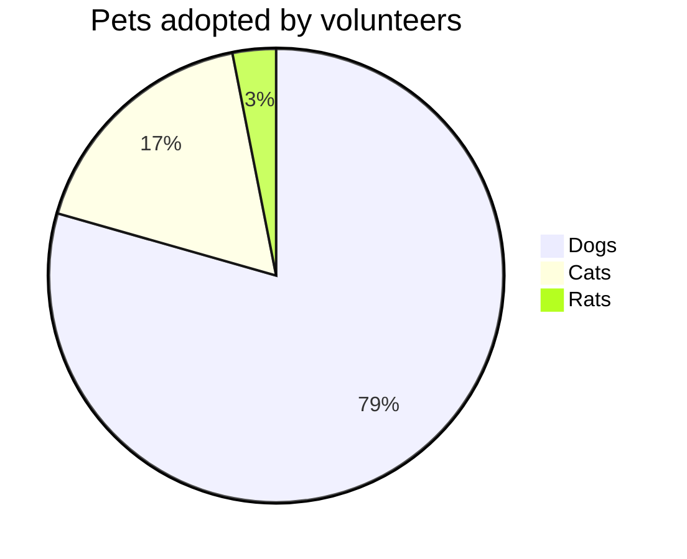
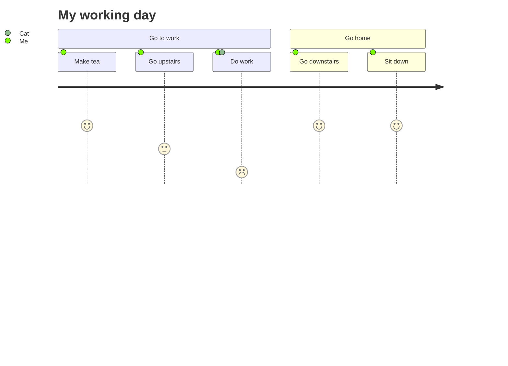
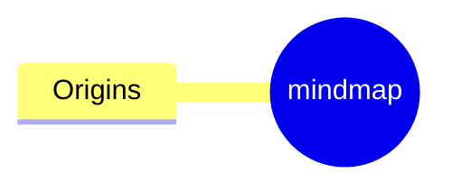
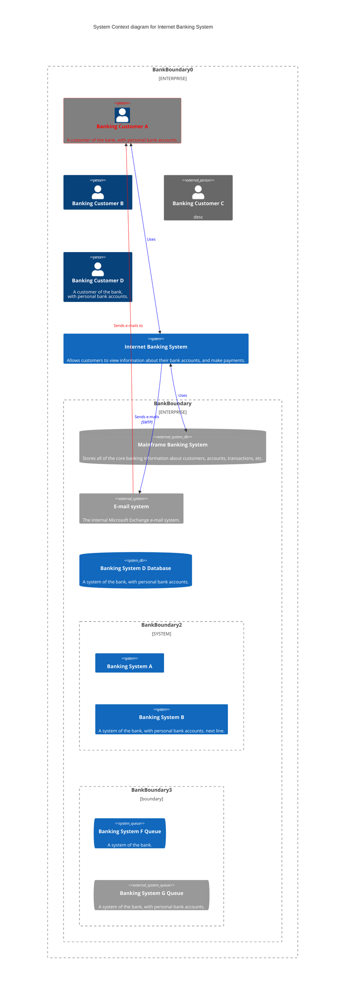

[Flowcharts - Basic Syntax | Mermaid](https://mermaid.js.org/intro/)

> # flowchart [LR, RL, TD(TB), DT]

> # SequenceDiagram

> # Gantt diagram

> # class diagram

> # Git Graph

> # Entity Relationship Diagram - ❗ experimental

> # Pie chart

> # User Journey Diagram

> # MindMap

> # Pie chart

| node | syntax | arrow | syntax |
| :-:| :-: | :-: | :-: |
| rectangle | [text] | arrow head  | --> |
| round edges | (text) | open link | --- |
| stadium-round | ([text]) | text on link  | --\|text\|-- |
| subroutine | [[text]] | arrow head | -->\|text\||
| databse | [(text)] | dotted | -.-> |
| circle | ((text)) | thick | ==> |
| asymmetric | >text] | chain | --> b & c|
| rhombus | {text} |new type |o--o, x--x |
| hexagon | {{text}} | | |
| parallelogram | [\text\\]| | |
|||||
| Length | 1 | 2 | 3 |
| Normal | --- | ---- | ----- | 
| Normal with arrow | --> | ---> | ----> | 
| Thick | === | ==== | ===== | 
| Thick with arrow | ==> | ===> | ====> | 
| Dotted | -.- | -..- | -...- | 
| Dotted with arrow | -.-> | -..-> | -...-> | 

break syntax
-->