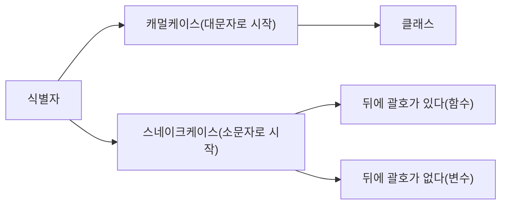

> 혼자 공부하는 파이썬 - 한빛미디어




``` python
for i, v in enumerate(list):
    (index, value)

map() -> func apply, filter -> func boolean
open(path, mode) 

def test():
    print(1)
    yield 1
    print(2)
    yield 2
    print(3)

output = test()
print(next(output)) # 1 출력
print(next(output)) # 2 출력
print(next(output)) # 3 출력

yield 키워드 사용시 해당 함수는 generator함수가 되며 함수를 호출해도 내부 코드가 실행되지 않음.(next() 사용만 가능.)

try except finally(break나 return으로 빠져나갈때도 무조건 실행,try except문에서 return이 들어간다면 finally로 빠져나갈때마다 close하는 코드를 간편히 만들 수 있다.)
note. 항상 켜져있는 프로그램을 daemon(데몬) 또는 service(서비스)fkrh qnfma.

raise [예외 객체]
아직 구현되지 않은 부분은 일부러 예외를 발생시켜 프로그램을 죽게 만들어 잊어버리지 않도록.

github 검색을 통해 코드를 어떻게 작성하는 지 파악할 수 있다. 좋은 코드를 짜려면 좋은 코드를 봐야하낟.

모듈 -> 표준(내장) 모듈, 외부 모듈
b'text' binary data
u'text' utf encoding data

제어 역전(개발자가 만든 함수를 모듈이 실행하는 것) 여부에 따라 구분
library 
framework

데코레이터 -> 함수 데코레이터, 클래스 데코레이터

__name__ 
프로그램의 진입점(엔트리 포인트 또는 메인)
모듈 내부에서 __name__을 출력하면 모듈의 이름을 나타냄.
즉 __name__ == __main__ 이라는 뜻은 모듈 내부에서 실행할 경우를 지정해주는 것.

import 로 가져오는 것은 module
pip python package index 패키지 관리 시스템, 결론적으로 모듈이 모여서 구조를 이루면 패키지라고 함.
directory를 만들고 module(.py)파일을 여러개 넣어두면 그 dir이 pakage가 됨.

__init__.py
패키지 내부의 모듈들을 한꺼번에 가져오고 싶을때, 패키지를 읽을 떄 __init__.py를 먼저 실행시킴.
__all__ = ['module1','module2']


1. 클래스
    
    class [클래스 이름]:
        def [메소드 이름]:
    
    클래스 변수
    클래스 변수 = 값
    클래스 이름.변수 이름

    @classmethod # 클래스 데코레이터, 클래스가 가진 기능이라는 것을 명시적으로 표기.

garbage collercotr
하드디스크를 메모리처럼 사용해 올리는 스왑(swap)

def __del__(self): # 프로그램이 종료될 삭제 즉, 소멸자
    print(f"{self.name}") 

프라이빗 변수 __<변수 이름> 변수 외부에서사용 되는 것을 방지.
게터(getter)와 세터(setter) : 프라이빗 변수 값을 간접적으로 접근하도록 해주는 함수.
def get_radius(self):
    return self.__radius
-> @property
def set_radius(self, value):
    self.__radius = value
-> @변수이름.setter

상속
class child(parent):
-> child class는 parent class의 함수와 변수 활용 가능.
parent class에 있는 함수를 자식에서 다시 정의하는 것을 재정의 또는 오버라이드라고 함.

def __str__(self):
    return "text"
```


python 지역변수, 전역변수 global 변수, 정적변수
함ㅅ구 내에서 생성, 호출 종료되면 메모리에서 제거ㅏ
함수 밖의 전역 공간에 선언된 변수, 함수 내 참조 변경 가능, 함수 밖 참조만 가능
함수 내와 밖, 참조 변경 둘다 가능
static변수 클래스 내부에 선언된 변수, class.var1 or class 영역 안에서 var = somthing 등으로 선언,정의된 클래스를 통해 호출이 가능하지만 직접 호출은 안됨, 클래스 변수로 함.
클래스는 클래스 변수와 객체 변수로 나뉨.

########################################################################################
First class function
함수 자체를 변수로 할당.
def test <function test ay 0x1016fe50> 처럼. 저장된 모듈 주소값
f = test
print(f, test) : <function test ay 0x1016fe50>, <function test ay 0x1016fe50>
즉, 함수를 인자로써 다른 함수에 전달이 가능. 그리고 클로저를 활용 할 수 있는 기반이 되는 개념.

closure | first class function을 지원하는 언어의 네임 바인딩 기술.
중첩 함수
def start(x):
def end(y):
return x+y
return end
closure1 = start(2)
closure2 = start(3)

closure1(3) => 5
closure2(3) => 6
=> 여기서 이러한 함수를 클로저 함수라고 함, start(x)로 이미 x를 할당받아 start의 역할이 끝나 end함수를 리턴했을때 생기는 차이.
=> start에서의 x인지가 사리지지않고 그대로 end에 저장되는 경우.

colusre.**closure**[0].cell_contents | 여기에 답긴 객체를 자유변수라하며 코드 영역에서 사용되지만 전역변수도 아니며 그 영역내에서도 정의 되지않는 변수 의미.

[https://schoolofweb.net/blog/posts/파이썬-데코레이터-decorator/](https://schoolofweb.net/blog/posts/%ED%8C%8C%EC%9D%B4%EC%8D%AC-%EB%8D%B0%EC%BD%94%EB%A0%88%EC%9D%B4%ED%84%B0-decorator/)
@Decorator | 기존에 코드에 여러가지 기능을 추가하는 파이썬 구문.
=> 대상 함수를 wrapping하고 warpping된 함수의 앞뒤에 추가적으로 꾸며질 구문들을 정의해서 손쉽게 재사용.
def decorator_function(original_function):
def wrapper_function():
print('{} 함수가 호출되기전 입니다.'.format(original_function.**name**))
return original_function()

```
return wrapper_function

```

@decorator_function  # 1
def display_1():
print('display_1 함수가 실행됐습니다.')

# display_1 = decorator_function(display_1) # 2

=> 위와 같이 #2같은 코드는 잘 사용하지않고 #1과 같이 '@'심볼과 데코레이터 함술의 이름을 붙여쓰는 간단한 구문 사용
##########################################################################################
import datetime
def datetime_decorator(func):
        def decorated():
                print datetime.datetime.now()
                func()
                print datetime.datetime.now()
        return decorated

# def main_function_1():

# print datetime.datetime.now()

# print "MAIN FUNCTION 1 START"

# print datetime.datetime.now()

위에서 아래로.
@datetime_decorator
def main_function_1():
        print "MAIN FUNCTION 1 START"

@datetime_decorator
def main_function_2():
        print "MAIN FUNCTION 2 START"

출처: [https://bluese05.tistory.com/30](https://bluese05.tistory.com/30) [ㅍㅍㅋㄷ:티스토리]
##########################################################################################
class
class DatetimeDecorator:
        def **init**(self, f):
                self.func = f

def **call**(self, *args, **kwargs):
                print datetime.datetime.now()
                self.func(*args, **kwargs)
                print datetime.datetime.now()

class MainClass:
        @DatetimeDecorator
        def main_function_1():
                print "MAIN FUNCTION 1 START"

@DatetimeDecorator
        def main_function_2():
                print "MAIN FUNCTION 2 START"

@DatetimeDecorator
        def main_function_3():
                print "MAIN FUNCTION 3 START"

my = MainClass()
my.main_function_1()
my.main_function_2()
my.main_function_3()
출처: [https://bluese05.tistory.com/30](https://bluese05.tistory.com/30) [ㅍㅍㅋㄷ:티스토리]


class1.a => 정적변수할당.

class a
class b

a.x = c 할당하면 a정적변수 할당으로 변하지않음.

class a

def **init**(self) -> None: pass

def 1

a.x = 1

def 2

a.x = 2

a1 = a

a2 = a

a1.1

a2.2

a1.x => 2

a2.x => 2, 이렇게 결과가 나옴. class a는 import 할때 딱한번만 생성되는거고 그뒤는 인스턴스값 <0x2318y89> 와 같은 것들이 생기는 것일뿐임.

a() -> init()실행 , a -> <**main**.a.g at 0x2e1abb955d0> 형태로 나옴


PEP8
> Underscore

1. single underscore, _ 
    - 언더스코어를 사용한 변수는 private 처럼 외부에서 접근하지 말라는 의미
    - 해당 모듈을 외부에서 참조할 경우 변수가 없는 것처럼 보이나 실제로는 접근 가능.
    - import 사용시 해당 변수는 import 되지 않음.
    - 그러나 직접 가져다 쓰는 것은 가능. 접근 제한을 권유하지만 강제하진 않음. 일종의 컨벤션.
2. double underscore, __
    - 마찬가지로 private를 구현하기 위해 사용.
    - 다만 접근 자체가 불가능.
    - 클래스 내 비슷한 이름들끼리 충돌을 방지하기 위함.
    - 더블 언더스코어를 사용함으로써 다른이름으로 치환하라고 알려줌
    - _변수명 -> _클래스명__변수명
    - 언더바 두개로 시작하는 변수 __c 는 내부에서 _Sample__c 로 변환이됨. 해당 클래스를 상속할때 override를 방지.
3. 뒤에 언더바 하나
    - 파이썬 키워드에 해당하는 이름으로 변수를 사용하고 싶을 때 사용
    - def func(class_) 처럼.
4. 앞뒤로 안더바 두개.
    - magic method 혹은 dunder 메소드라 함.


```
VS Code에서 low level 언어인 C/C++ 문제.  
VS를 깔아서 C/C++코드를 볼 수 있는데 VS code라는 IDE tool을 사용하고 있으니
enviroment설정을 통해 VSC에서 한번에.(https://webnautes.tistory.com/1158)


AWS test 서버 연동기

1. awscli 설정
2. kubectl 설정
3. port-forward 실행
4. 데이터베이스 접속

Win OS여서  
Linux 설치를 위해 WSL2 설치  
Ubuntu 설치

AWS cli :  https://docs.aws.amazon.com/ko_kr/cli/latest/userguide/getting-started-install.html  

curl "https://awscli.amazonaws.com/awscli-exe-linux-x86_64.zip" -o "awscliv2.zip"
apt install unzip
unzip awscliv2.zip
sudo ./aws/install

<!--  download the latest release -->
curl -LO "https://dl.k8s.io/release/$(curl -L -s https://dl.k8s.io/release/stable.txt)/bin/linux/amd64/kubectl"
<!-- install kubectl -->
sudo install -o root -g root -m 0755 kubectl /usr/local/bin/kubectl
<!-- check version -->
kubectl version --client 


aws의 api를 직접 호출할 수 있게 도와주는 명령어.
인증 정보가 저장된 파일 설정.
~/.aws/credentials | 인증과 관련된 값들
~/.aws/config | 그 외의 값들

$ aws configure
AWS Access Key ID [None]: 
AWS Secret Access Key [None]: 
Default region name [None]:ap-northeast-2 | seoul region
Default output format [None]: yaml

aws eks update-kubeconfig --region ap-northeast-2 --name mealion

% 다시 접속할때 여기서 부터 실행하기.
kubectl -n api-prod get pods % 
kubectl -n api-dev port-forward name 5432:5432

cubuctl : https://kubernetes.io/docs/tasks/tools/

aws 로그인  

MFA(멀티 팩터 인증) : google OTP
```


```python
## process bar
from tqdm import tqdm
for i in tqdm(list or range, desc='', total=int):
    i

## display
from IPython.display import display
display() # ipynb html을 생성하여 보여줌

## warnings
import warnings
warnings.filterwarnings(action='ignore')
```

### 객체지향 프로그래밍 & Python
```python
### 중첩 클래스 사용 이유
# 알고리즘이나 코딩을 하는 이유는 절차적인 사고 능력을 키우기 위해서.
# https://sjh836.tistory.com/145
# https://zzsza.github.io/development/2020/07/05/python-class/
# https://www.geeksforgeeks.org/inner-class-in-python/
# verbose : 한국어로 해석하면 '말이 많은' 즉, 관련 함수에서 로그 출력에 관한 내용들이다. 

#### About Docker
# docker --compose start # 컨테이너 재개
# docker-compose start mysql # mysql 컨테이너 재개
# Visual Studio Code에서 Docker 컨테이너를 개발 환경으로 사용 : https://docs.microsoft.com/ko-kr/learn/modules/use-docker-container-dev-env-vs-code/
# firefox scrap

# 객체 지향 프로그래밍, class 등
# https://zzsza.github.io/development/2020/07/05/python-class/
# e-commerce(?)


# python server.py run
# <!-- http://pythonstudy.xyz/python/article/24-%EC%93%B0%EB%A0%88%EB%93%9C-Thread -->


# Linux, ubuntu Docker 의 필요성?
# 파이썬 가상환경의 필요성 : https://windybay.net/post/13/
# 윈도우와 리눅스의 차이점 : https://likecode.tistory.com/284

# 연관 피드 처럼 코드를 볼떄 전체적으로 기능적 요구사항을 파악해야함
# 성능 검사 시 time series로 

# 한국어 자연어처리 사이트 : https://littlefoxdiary.tistory.com/42
# https://github.com/songys/AwesomeKorean_Data

# NCP(Naver Cloud Platform) : tjy2202@naver.com


# yiled & generator
# =================================================================================================
# https://www.daleseo.com/python-yield/

# exception
# https://wayhome25.github.io/python/2017/02/26/py-12-exception/

import os
os.getcwd()
#os.chdir('C:/Users/users')
os.path.isdir('C:/Users/users')
#os.makedirs('C:/Users/users/Destop/0713')
# [WinError 5] 액세스가 거부되었습니다: 'C:/Users/users'


# About self
# ======================================================================================================
# class MyStatus:
#     def __init__(self,age,name,height,weight):
#         self.age = age

#     # self 인자 안넣으면 self.call_json 할떄 positional arguments error 남
#     # positional arguments : 위치 인자(*), keyword arguments : 키워드인자(** dict형태)
#     def print_name(self):
#         print(self.name)

# a = MyStatus(34,"yamada",170,78)
#출처: https://engineer-mole.tistory.com/190 [매일 꾸준히, 더 깊이:티스토리]


# main
# ======================================================================================================
# if __name__ == '__main__':
    # 현재 .py file 실행시 돌아가는 코드
    # 즉, 다른 .py file에서 불러와 실행하면 실행이 안됨.
    # python은 c, java와 달리 시작위치(?) 설정이 따로 없어 해당 코드를 넣으면 코테떄 속도 향상.

# train & scaler model save and load
# ======================================================================================================
# https://m.blog.naver.com/wideeyed/221330321950

# from sklearn.externals import joblib
# import pickle

# # save
# obj = 'object' # model or scaler
# file_name = 'file_name.pkl'

# joblib.dump(obj, file_name)
# pickle.dump(obj, open(file_name, 'wb'))

# load
# obj = joblib.load(file_name)
```